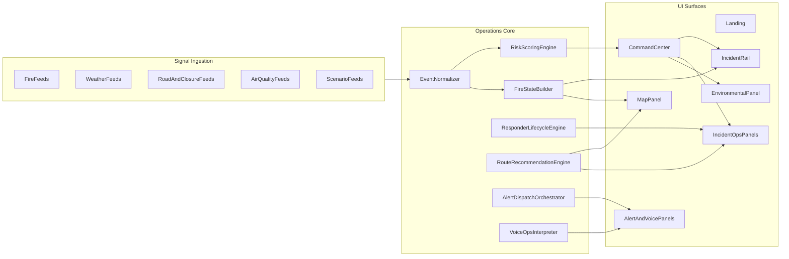

# Evacua Operations Dashboard Plan

## 1) Product Direction (Authoritative)

Evacua is now a wildfire operations dashboard.  
It is no longer positioned as a household evacuation copilot.

### Core objective

Deliver a real-time command surface that supports:

- active incident monitoring
- environmental risk intelligence
- responder dispatch coordination
- route update and evacuation recommendation workflows
- voice-assisted command actions
- emergency alert dispatch

### Design constraint

All functionality is implemented in Evacua's current visual system:

- OLED dark foundation
- premium minimal card hierarchy
- restrained accent usage
- calm but operational interaction motion

No external visual skin is adopted.

## 2) Current Build Status

### Implemented foundation

- Operations-first command center framing has started:
  - landing CTA now points directly to command center
  - key copy has been shifted toward incident operations
- Operational backend endpoints now exist:
  - `src/app/api/fire-state/route.ts`
  - `src/app/api/dispatch-responder/route.ts`
  - `src/app/api/update-routes/route.ts`
- Responder simulation and state engine exists:
  - `src/lib/ops/responder-sim.ts`
- Command center operational telemetry has begun:
  - fire/responder polling hook
  - top bar incident/team metrics
  - incident rail risk labeling improvements

### Still incomplete

- full screen-by-screen parity for all dashboard behaviors
- complete incident list workflow parity
- complete voice operations workflow parity
- complete responder/dispatch UX parity across all panels
- complete route/evacuation recommendation UX parity
- complete operational docs/readme cleanup and acceptance checklist

## 3) Target Architecture

## 4) Surface Contract

### `/` Landing

Purpose: immediate transition into command workflows.

Must show:

- operations-first positioning
- clear "Open command center" primary action
- quick scenario launch action
- confidence anchors (live signals, dispatch, alerts, voice)

### `/plan` Command Center

Purpose: main operational surface.

Must include:

- top-level operational KPIs
- active incident rail
- map operations with focused incident context
- responder controls
- route and evacuation context
- environmental conditions
- voice + alerts command utilities

### `/setup`

Purpose: optional profile/metadata setup, not required gate for operations.

Behavior:

- command center remains functional without setup completion
- setup text references operations profile, not household planning

## 5) Data/State Contracts

### Incident model

- id, name/headline, severity/risk, containment, source, location, timestamps

### Responder model

- station, team, status, incident link, dispatch/eta timestamps

### Route ops model

- route updates (old/new), reason, risk score, timestamps

### Evacuation recommendation model

- fire id, zone label, polygon, recommendation timestamp

### Environmental model

- temperature, humidity, wind, visibility, AQI/PM, derived fire risk score

## 6) Implementation Roadmap

## Phase A — Surface parity

- complete operations-first rewrite of all user-facing copy on landing and command center
- remove remaining household-only language in panel titles, empty states, and actions
- ensure command center is first-class default user path

## Phase B — Incident and fire-state workflows

- finalize incident list behavior (sorting, severity badges, drill-in interactions)
- wire fire-state API outputs to visible map/rail operational markers
- ensure selected-incident context drives all right-panel workflows

## Phase C — Responder lifecycle

- complete dispatch UX with feedback + failure handling
- show responder state progression clearly (available/dispatched/en-route/on-scene)
- connect responder activity to containment/incident context indicators

## Phase D — Environmental intelligence

- expand panel to show operational risk factors (not only raw metrics)
- provide quick interpretation bands and confidence cues
- sync environmental context to selected incident when applicable

## Phase E — Route and evacuation operations

- expose route update feed to command center UI
- expose evacuation recommendation records and map overlays
- allow operator inspection and acknowledgment flows

## Phase F — Voice and comms operations

- complete voice command intent paths for operations questions/actions
- harden alert dispatch channel behavior and audit logs
- align command wording and transcripts with operations terminology

## Phase G — Reliability and polish

- finalize error/empty/loading states in all operational panels
- validate fallback behavior for unavailable upstream feeds
- run final design-language consistency pass

## 7) File-Level Execution Map

### Primary app shells

- `src/app/page.tsx`
- `src/app/plan/page.tsx`
- `src/app/setup/page.tsx`

### Command center components

- `src/components/command-center/top-bar.tsx`
- `src/components/command-center/signals-rail.tsx`
- `src/components/command-center/map-panel.tsx`
- `src/components/command-center/plan-panel.tsx`
- `src/components/command-center/incident-ops-panel.tsx`
- `src/components/command-center/incident-ops-drawer.tsx`
- `src/components/command-center/home-conditions-panel.tsx`
- `src/components/command-center/ops-voice-panel.tsx`
- `src/components/command-center/alert-dispatch-panel.tsx`

### API routes

- `src/app/api/signals/route.ts`
- `src/app/api/fire-state/route.ts`
- `src/app/api/dispatch-responder/route.ts`
- `src/app/api/update-routes/route.ts`
- `src/app/api/weather/route.ts`
- `src/app/api/send-emergency-alert/route.ts`

### Core logic/hooks

- `src/lib/ops/responder-sim.ts`
- `src/lib/hooks/use-fire-ops.ts`
- `src/lib/hooks/use-responder-ops.ts`
- `src/lib/hooks/use-home-conditions.ts`
- `src/lib/alerts/compose.ts`
- `src/lib/video/signal-preview.ts`

## 8) Acceptance Criteria

Evacua is considered fully pivoted when all are true:

- landing and command center are unambiguously operations-focused
- command center is fully usable without setup gating
- incidents, responders, routes, and environmental intelligence are visibly integrated
- dispatch and alert actions are functional with clear feedback states
- voice operations can execute key command intents reliably
- all major operational actions are represented in UI and backend state
- visual consistency remains fully Evacua-native

## 9) Guardrails

- Avoid introducing external visual language.
- Keep all naming and copy aligned to wildfire operations.
- Preserve deterministic fallback behavior for demos.
- Maintain modular APIs/hook boundaries to keep integration readable and testable.

